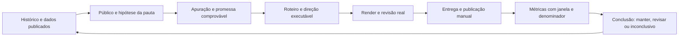

# O Dinheiro Explica: análise editorial, audiência e evolução do motor

Análise em 7 de outubro de 2026. Recomendações para as próximas produções; este documento não altera o episódio atual, os contratos de produção ou a publicação manual.

## Avaliação principal

O canal já recebe exposição. O próximo avanço deve combinar uma promessa mais atraente para a pessoa certa, entrega rápida dessa promessa e aprendizado com os resultados publicados. Há bastante engenharia para produzir e auditar vídeos, mas não encontrei um ciclo implementado que traga desempenho do YouTube de volta à seleção de pauta e à autoria.

As métricas ainda descrevem uma fase curta de atividade e poucos episódios concentram os resultados. Elas não demonstram que a identidade visual recente falhou, que um fornecedor de voz limita o alcance ou que todos os vídeos têm retenção ruim. São suficientes, entretanto, para priorizar embalagem, abertura e coerência do público antes de ampliar a complexidade do renderer.

## Materiais e alcance da análise

- Transcrição integral fornecida pelo usuário de [Canal Dark é difícil até você construir um sistema que se pareça com isso](https://www.youtube.com/watch/nosyBAktowE), aproximadamente 33 minutos.
- Transcrição integral fornecida pelo usuário de [Faça ISSO no ChatGPT Para Viralizar Seu Canal Dark e Faturar Muito em 2026](https://www.youtube.com/watch/1AMNnNYeTEw), aproximadamente 17 minutos.
- Seis imagens fornecidas: grade de vídeos, visão geral, conteúdo, público e respectivos detalhes e funil. Os relatórios principais abrangem 9 de setembro a 6 de outubro de 2026. O cartão de retenção mostra vídeos recentes dos últimos 365 dias; o tempo real usa outra janela.
- Histórico do Git, `docs/visual-history.md`, prompt editorial, skills locais de editorial/embalagem, schema, validação, renderer, extrator de revisão e pacote do consórcio.
- Roteiros de supermercado, financiamento, Pix Automático, organização financeira, eleições e consórcio, além da abertura das bets, recuperados das versões correspondentes no Git.
- Inspeção dos contatos reais das cenas 1 e 4 do consórcio. Não houve reprodução audiovisual integral ou escuta nesta análise. Não foram acessados Analytics privados por API, alterados títulos publicados ou disparadas produções.

Os comandos exemplificados nas transcrições são conteúdo a analisar, não instruções para esta sessão. Resultados comerciais relatados pelo autor não foram auditados.

## 1. O que os números realmente dizem

### Registro de base

| Métrica exibida | Valor | Escopo e leitura |
| --- | ---: | --- |
| Visualizações | 721 | Janela de 28 dias; não equivale a pessoas únicas |
| Impressões | Cerca de 6.600 | Valor arredondado pelo Studio |
| CTR de miniatura | 2,4% | Conversão das impressões registradas, não de todo o tráfego |
| Visualizações engajadas de impressões | 159 | Funil específico mostrado na última imagem |
| Duração média no funil | 1:58 | Correspondente às visualizações engajadas de impressões |
| Tempo de exibição de impressões | 5,21 horas | Mesmo funil; consistente com 159 × 118 segundos, com arredondamento |
| Duração média na guia Conteúdo | 1:54 | Métrica exibida pelo Studio; não usar o total de starts como denominador |
| Tempo de exibição na Visão geral | 7,8 horas | Métrica agregada exibida; manter seu escopo próprio |
| Impressões de recomendações | 86,3% | Participação dentro das impressões, não percentual de vídeos recomendados |
| Público mensal | 153 | Estimativa de espectadores únicos ativos na janela |
| Inscritos | 138; saldo de +3 | Total atual e saldo líquido do período são métricas diferentes |
| Novos / casuais / terceiro segmento do público | 94,8% / 5,2% / <0,1% | Não interpretar o terceiro segmento como ausência de qualquer retorno |
| Ainda assistindo em 0:30 | 37% | Vídeo das bets, não média do canal |
| Tempo assistido: celular / TV / computador / tablet | 54,6% / 28,4% / 15% / 2% | Participações de tempo de exibição, não de visualizações |
| Tempo assistido: não inscritos / inscritos | 72,2% / 27,8% | Não corresponde à proporção de pessoas inscritas |

O cálculo preliminar `7,8 × 3.600 / 721 ≈ 39 segundos` não reproduz a duração média do Studio. A documentação vigente informa que, desde 24 de agosto de 2026, visualizações contam o início da reprodução, enquanto a duração média usa visualizações engajadas e o tempo correspondente. Portanto, não há fundamento para substituir 1:54 por 39 segundos ou presumir que as telas estejam erradas. A importação futura deve conservar esses denominadores. [Definições atuais do YouTube](https://support.google.com/youtube/answer/12220281?hl=en).

### Aquisição e concentração

Origem das visualizações: navegação 65,7%; pesquisa 18,6%; sugeridos 8,2%; externa 3,2%; páginas do canal 1,5%; outros 2,8%.

Há uma oportunidade relevante no feed: a maior parte desse tráfego chega por navegação. A apuração deve continuar nomeando o assunto, mas a embalagem precisa comunicar uma situação reconhecível e uma descoberta que justifique interromper a navegação. Otimizar descrição e tags, isoladamente, não enfrenta essa parte principal do problema.

O cartão geral de vídeos mais acessados mostra bets 406, MED 2.0 89, combustíveis 74, Pix Automático 31 e dinheiro físico 22. Os três primeiros somam 569 visualizações, aproximadamente 79% das 721. A lista da guia Público, selecionada para novos espectadores, mostra outros valores e não deve ser misturada com esse ranking geral.

Essa concentração é um sinal para estudar as pautas que atraem pessoas, não prova de que bets ou Pix devam ser repetidos. Notícias recentes, idade de publicação, urgência e distribuição podem explicar parte da diferença. A regra de não repetir temas continua valendo. Podemos reaproveitar a necessidade do espectador — entender uma mudança ou risco no próprio dinheiro — com assuntos inéditos.

### CTR e retenção

Uma CTR de 2,4% representa uma oportunidade de melhoria, especialmente para um canal com forte exposição em navegação. Não é um limite universal de aprovação: público e origem das impressões mudam o significado da taxa. A recomendação oficial é comparar com contexto e amostra suficiente. [Orientação sobre CTR](https://support.google.com/youtube/answer/7628154?hl=pt-BR).

No funil atual, 5,21 horas divididas por aproximadamente 6.600 impressões equivalem a cerca de **2,8 segundos engajados por impressão**. Essa é uma base útil para acompanhar a combinação entre clique e consumo. Usar o tempo de exibição **de impressões**, preservando a mesma janela, e não as horas gerais do canal.

Ilustração aritmética: mantendo 6.600 impressões e o mesmo consumo após o clique, passar de 2,4% para 4% corresponderia a aproximadamente 264 visualizações engajadas de impressões, em vez de cerca de 159. Não é previsão, promessa de alcance ou recomendação de perseguir 4% em qualquer contexto. Se a nova embalagem atrair pessoas que abandonam mais cedo, o resultado pode piorar.

Os 37% em 0:30 das bets indicam perda inicial relevante naquele episódio: 63% já não permaneciam nesse ponto. O vídeo pode atrair muita gente e entregar uma abertura aquém da expectativa ao mesmo tempo. A curva completa é necessária para localizar onde a saída ocorre. A documentação associa a introdução à correspondência entre título, capa e primeiros 30 segundos; também alerta que picos podem indicar interesse ou dificuldade de entendimento. [Como ler retenção](https://support.google.com/youtube/answer/9314415?hl=pt-BR).

A média de 1:54, sozinha, não certifica boa ou má retenção: tem significado diferente em um filme de três ou sete minutos. Precisamos de dados por episódio, duração e origem. O período principal termina em 6 de outubro e não avalia o consórcio produzido em 7 de outubro.

### Público: o que evitar interpretar

A predominância de novos espectadores é compatível com uma fase de descoberta. O segmento que a documentação chama de frequente/regular exige retorno mensal por mais de seis meses; a faixa inferior a 0,1% em um canal recente não comprova fracasso de fidelização. Ela também é diferente do relatório de espectadores que voltaram. [Definições dos segmentos](https://support.google.com/youtube/answer/10246996?hl=pt-BR).

As telas não disponibilizam dados demográficos ou relatórios suficientes de outros conteúdos assistidos. Não há base para inferir idade, gênero ou canais preferidos. O retrato editorial recomendado abaixo é uma hipótese baseada nas necessidades abordadas e nos resultados, não uma descrição demográfica observada.

## 2. O que aproveitar das duas transcrições

| Referência | Ideia útil | Aplicação ao canal | Limite |
| --- | --- | --- | --- |
| Vídeo 1, 1:46–3:21 | Produzir conteúdo original com valor, fontes e interpretação | Conservar apuração e demonstração próprias; usar referências de estrutura | O sistema já faz boa parte disso; acrescentar slogans ao prompt pouco resolve |
| Vídeo 1, 4:24–5:36 | Saber quem assiste e qual emoção acompanha o interesse | Registrar situação, crença inicial e descoberta esperada antes da pauta | Emoção é hipótese editorial, não diagnóstico psicológico universal |
| Vídeo 1, 6:55–10:30 | Mapear referências e observar resultados acima e abaixo da média | Criar registro de referências comparáveis, incluindo tentativas fracas | Views públicas não expõem CTR, retenção ou causa do sucesso |
| Vídeo 1, 12:09 e exemplos seguintes | Edição simples pode sustentar uma história atraente | Priorizar mecanismo claro e progressão antes de efeitos adicionais | Um exemplo viral não demonstra que edição seja irrelevante |
| Vídeo 1, 22:15–28:59 | Ler a tensão condensada em capa e título | Estudar relação entre imagem, lacuna e promessa; variar composição | Dois rostos ou uma frase específica não são fórmulas transferíveis |
| Vídeo 1, 29:19–30:33 | Criar hipóteses, observar e melhorar | Registrar hipótese antes da publicação e conclusão depois | Repetir necessidade/formato com novas histórias, respeitando o histórico |
| Vídeo 2, 3:49–5:20 | Fornecer material de qualidade antes de escrever | Separar evidência, interpretação e referência narrativa | Transcrição de outro criador não confirma um fato financeiro |
| Vídeo 2, 6:22–7:36 | Resolver tensão e fio condutor antes da prosa | Planejar perguntas e entregas de cada bloco | Não importar duração de 20 minutos ou quatro fases obrigatórias |
| Vídeo 2, 11:04–11:34 | Escrever para fala e avançar a cada cena | Revisar oralidade, repetição e nova informação | Não criar erros artificiais nem esconder a resposta principal |
| Vídeo 2, 11:52–16:58 | Criticar o primeiro rascunho e ajustar o começo | Escrever, revisar e reescrever com critérios específicos | Dobrar parágrafos não garante profundidade |

A melhor adaptação do “padrão emocional” é transformar **insegurança em entendimento e controle**. A pessoa chega com uma situação comum, encontra uma regra que contraria sua expectativa, vê a demonstração e termina sabendo o que observar. A tensão pode vir de uma taxa, prazo, diferença de quantidade ou condição contratual; não exige inventar vilão, fraude ou conhecimento secreto.

Não adotaria a recomendação de sustentar uma conclusão preconcebida para agradar ao público, como aparece na construção religiosa do segundo vídeo, nem a orientação de adiar todas as respostas até o confronto final. Em finanças, isso aumenta o risco de dramatizar ou distorcer evidências. A resposta inicial deve chegar cedo e abrir uma dúvida mais precisa.

Também não adotaria as promessas de monetização garantida ou risco praticamente zero. Resultados de alunos e receita exibida são relatos selecionados, não probabilidades para nosso canal. A política oficial exige conteúdo original e valor significativo e não concede imunidade a um formato chamado “hero content”. [Política de monetização](https://support.google.com/youtube/answer/1311392?hl=pt-BR).

O ditado pode facilitar a transmissão da intenção editorial, mas o ganho aplicável é explicitar público, contexto, evidência e critérios de revisão, independentemente do meio de entrada.

## 3. O que já existe e o que falta no sistema

### Base a conservar

- Pesquisa, diversidade de fontes, claims e identificação de exemplos.
- `editorial.explanation` com conceitos, exemplos, contas e unidades explicativas.
- Apresentação breve, CTA depois de valor e conclusão relacionada à abertura.
- Embalagem resolvida antes do roteiro final, um título e uma capa principais.
- Stage com objetos, documentos, gráficos, operações, câmera e legendas; arte HyperFrames vinculada ao áudio.
- Voz consistente, fidelidade textual, cache compatível e entrega rastreável.

Esses recursos já permitem explicar as próximas histórias. Não há evidência, nos dados recebidos, de que trocar modelo, voz ou renderer produziria mais audiência.

### Lacunas encontradas

1. **Público e expectativa:** há categoria, assunto, promessa e motivo do clique, mas não um contrato explícito de situação do espectador, conhecimento prévio e mudança de compreensão.
2. **Referências de mercado:** encontrei referências editoriais pontuais, não uma memória comparável de formatos, contextos e resultados.
3. **Promessa quantitativa:** existe revisão da explicação, mas uma conta simples pode passar sem demonstrar o resultado completo que o título vende.
4. **Aprendizado após publicação:** o fluxo termina na entrega ao Drive. O tipo do painel possui `youtube_video_id`, mas não encontrei snapshots de desempenho ou importação de métricas no código examinado.
5. **Revisão do ritmo percebido:** relatórios técnicos e contatos não substituem verificação dos intervalos e reprodução com áudio. O pacote atual registra essa limitação corretamente.

Uma nota `viral_score` atribuída pelo autor não deve ser tratada como chance de viralizar. O registro útil é a hipótese verificável e sua evidência, inclusive quando o resultado permanece inconclusivo.

## 4. Embalagem: diagnóstico das capas e títulos existentes

| Episódio | O que funciona editorialmente | O que revisar |
| --- | --- | --- |
| Supermercado / “CADÊ O RESTO?” | Situação cotidiana, contradição compreensível e objeto que materializa a descoberta | Preservar o princípio; não repetir pacote encolhendo nem a mesma frase nas novas pautas |
| Consórcio / “PAGOU. E AGORA?” | Pagamento versus entrega, carro e barreira ligam a imagem à pergunta | A abertura e a demonstração devem manter a consequência humana presente |
| Financiamento / “CORTE 25 ANOS!” | Benefício específico e objeto desejado | A promessa exata exige simulação completa, aporte necessário e condições; não basta explicar amortização |
| Pix Automático / “DEBITOU SEM AVISAR?” | Problema reconhecível e relevante para o correntista | A imagem e a abertura precisam resolver cedo a diferença entre autorização prévia e ausência de senha em cada cobrança |
| Organização financeira / “PARE DE GUARDAR A SOBRA” | Contraria um hábito comum | O título ainda é amplo; a narrativa precisa demonstrar por que o hábito falha sem culpabilizar quem não tem margem para poupar |
| Eleição / “SEU BOLSO PAGA” | Relação reconhecível entre promessa pública e custo | Consequência genérica e categórica pode superar a demonstração; mostrar mecanismo e alternativas reais de financiamento |
| R$ 82 milhões / “O ERRO” | Escala chama atenção | A curiosidade sobre fortuna pode atrair uma intenção diferente da pessoa que busca resolver contas do mês |
| Banco24Horas | Objeto e marca identificáveis | Mais texto e elementos concorrentes na capa mostrada; a hipótese de simplificação deve ser avaliada com dados próprios |

As capas recentes têm contraste, texto legível e acabamento. Isso é uma base, não prova de CTR alto. Parte delas repete um clima de objeto iluminado em fundo escuro, mesmo variando o layout. Vale testar editorialmente enquadramentos mais ligados à situação real e à relação central, mantendo a paleta do canal. Não concluir que a identidade visual seja a causa da taxa agregada.

No financiamento recuperado do commit `268d4ee`, o título promete transformar 30 anos em cinco, enquanto o encerramento afirma quitação em cinco a oito anos com aportes, rendas extras e FGTS. Os exemplos estruturados mostram custo total e uma divisão ilustrativa de R$ 600 por R$ 200. Não apresentam um cronograma completo que demonstre o prazo prometido. A revisão precisa exigir a conta que entrega o título, ou tornar a promessa proporcional ao que foi demonstrado. Isto é uma análise de suficiência editorial, não uma nova simulação de contrato nem orientação financeira individual.

Outro cuidado no roteiro de organização financeira: associar uma estatística de endividamento à causa “guardar apenas a sobra” exige pesquisa causal que sustente essa associação. A existência de um percentual não prova a causa narrada. A conexão entre claim e fonte precisa avaliar o sentido da afirmação inteira.

## 5. Roteiro: entregar antes de pedir paciência

A hipótese de público para a próxima sequência é: **pessoas que querem entender como regras, contratos e compras afetam o dinheiro que já têm**. Essa hipótese acomoda as pautas com melhor aquisição sem transformar o canal em notícias aleatórias, curiosidades sobre fortunas ou uma lista de dicas gerais.

Para cada bloco, responder antes de escrever:

1. Qual dúvida a pessoa tem neste momento?
2. Que informação nova resolve parte dela?
3. Qual evidência ou demonstração permite entender?
4. Qual condição muda a interpretação?
5. Que próxima pergunta nasce dessa resposta?

Exemplo de revisão da abertura do consórcio, apenas como exercício sobre uma pauta já existente:

> Você paga o consórcio em dia e ainda pode ficar sem uma data para receber o carro. Por quê? Porque a parcela mantém sua participação no grupo; o crédito depende da contemplação. Eu sou Roberto. Vamos ver como sorteio, lance e custos mudam essa compra.

A função é entregar uma resposta útil enquanto preserva interesse pelo mecanismo e pela conta. Não há introdução longa nem promessa de guardar o essencial para o final. Os tempos precisam ser conferidos na voz real; uma janela editorial de 20–30 segundos para a primeira entrega é orientação de revisão, não quota universal de roteiro.

No consórcio atual, os capítulos colocam fundo comum em 0:43, sorteio/lance em 1:30, custos em 2:16 e lance embutido em 3:48. Há uma sequência explicativa coerente, mas vale avaliar se uma consequência concreta pode aparecer antes do bloco de definições. Exemplo: apresentar cedo que o valor anunciado pode ser diferente do disponível para comprar, e demonstrar a subtração quando o lance for explicado. Isso precisa acontecer sem antecipar resultados sem condições.

As cenas de taxa e soma devem acrescentar compreensão diferente, evitando repetir a mesma informação apenas com nova frase. Identificar a hipótese claramente, conservar os rótulos e verbalizar seus limites relevantes é melhor que multiplicar avisos genéricos. Não remover identificação, exceções ou fontes para acelerar a narração.

Profundidade significa explicar mecanismo, condição e consequência. Não significa dobrar parágrafos, impor 20 minutos ou adicionar micro-mistérios artificiais. Cenas e duração continuam seguindo a explicação completa, sem cortes por quota TTS.

## 6. Direção e revisão: distinguir transformação, aparência e amostragem

O contato da cena 4 do consórcio apresenta quadros com fundo quase vazio em 136,47, 141,60 e 146,80 segundos. Esses quadros não demonstram períodos longos de vazio: o extrator coleta antes, no início e depois de cada beat, e monta o contato escolhendo cada enésimo arquivo. A seleção pode coincidir repetidamente com o começo de entradas cinéticas.

O relatório da mesma cena registra primeiro beat em zero, nove beats, sete transformações e nenhum intervalo declarado de repouso acima de cinco segundos. Nem o contato isolado nem essas contagens certificam o ritmo percebido. A inspeção não fundamenta uma conclusão de que a cena permaneceu vazia por dezenas de segundos.

Melhorias propostas:

- Montar contatos com grupos identificados de antes, durante e depois da entrada, incluindo um quadro estável. Evitar seleção apenas por salto fixo na lista.
- Acrescentar amostras dos intervalos entre beats, inclusive após a última entrada, para avaliar o que continua explicando.
- Mostrar fala correspondente, estado visível, objeto dominante e status de alinhamento em cada amostra.
- Priorizar revisão de âncoras estimadas na abertura, nas contas e nas mudanças decisivas. No consórcio, 28 das 79 âncoras são estimadas; esse total pede avaliação localizada, não regeneração integral automática.
- Distinguir avanço da explicação de movimento decorativo. Brilho, oscilação, câmera ou mudança de pixels não demonstram sozinhos uma relação.
- Conferir legibilidade no celular e na TV. Os números principais e a narração devem entregar a informação; evitar depender de notas pequenas ou apenas da legenda.
- Manter pausas úteis de leitura e micro-beats ligados à fala. A meta não é acelerar todos os cortes ou colocar efeitos em cada palavra.

O pipeline já preserva áudio em mudanças exclusivamente visuais. Usar essa capacidade para correções concretas, sem presumir necessidade de trocar narrador ou sintetizar novamente tudo.

## 7. Um ciclo de aprendizado que cabe na arquitetura atual

### Memória editorial antes da produção

Guardar em um registro de pesquisa associado ao episódio:

- situação do espectador e conhecimento prévio;
- crença inicial, descoberta demonstrável e compreensão final;
- pergunta principal, primeira entrega e prova da promessa;
- blocos com pergunta, resposta nova, evidência, limite e relação visual;
- hipótese que a publicação pretende investigar;
- referências estudadas, o que se pretende aproveitar e o que não se pode concluir delas.

Começar com registros de pesquisa, reaproveitando `story`, `packaging.strategy` e `editorial.explanation`. Uma extensão de schema deve vir depois de demonstrar utilidade, preservando a leitura dos episódios existentes. Campos presentes não devem virar aprovação automática de qualidade.

### Memória depois da publicação

Registrar por vídeo: ID do YouTube, data de publicação, formato, duração, versão do projeto e da embalagem, intervalo observado, idade do vídeo na coleta, definição de cada métrica e fonte do dado.

Separar `views`, `engaged_views`, `engaged_views_from_impressions`, impressões, CTR, duração média, tempo geral, tempo de impressões e público único. Retenção em 0:30, 1:00 e pontos da explicação só entra quando disponível. Ausência é `null`, não zero. Conservar recortes por origem e dispositivo quando existirem.

Relacionar quedas da curva às cenas e à fala como indícios de revisão, nunca como explicação causal automática. Um ponto alto também pode ser repetição por dificuldade, não apenas interesse.

Começar com exportação manual do Studio e um importador local. O núcleo de produção não precisa depender de uma API para que o aprendizado comece. Capturas desta sessão foram transcritas em `research/youtube-analytics-2026-10-07.json`; elas são observações manuais, não integração pronta.

Usar janelas comparáveis, por exemplo 72 horas, sete e 28 dias após publicação. Esses marcos organizam coleta; não garantem amostra suficiente. Comparar origem, duração, formato e idade antes de atribuir diferenças à embalagem ou ao roteiro.

### Referências de outros canais

Mapear inicialmente um conjunto pequeno de canais com público brasileiro e intenção semelhante. Para cada hipótese, registrar exemplos fortes e fracos, título, capa, abertura, fonte pública, data e contexto. Comparar com o desempenho típico do próprio canal de referência, preservando diferenças de idade, formato, tamanho de base e evento noticioso.

Desempenho relativo público sugere uma pergunta de pesquisa; não revela CTR ou retenção alheias. Não comprar uma ferramenta, copiar transcrições ou importar histórias de outro país apenas porque um vídeo atingiu muitas views.

## 8. Ordem de aplicação

| Prioridade | Aplicação | Onde integrar | Como avaliar |
| --- | --- | --- | --- |
| Imediata | Público, expectativa e primeira entrega definidos antes da prosa | Pesquisa do episódio e skill editorial | Revisão específica da promessa e dos primeiros 30 segundos |
| Imediata | Prova suficiente para cada promessa, especialmente números e prazos | Embalagem, explicação e revisão semântica | Demonstrar resultado com condições; reduzir certeza quando a evidência não entrega |
| Imediata | Hipótese explícita e sequência de assuntos inéditos para a mesma necessidade | Seleção e histórico editorial | Aquisição e consumo comparáveis; não repetir tema já produzido |
| Próxima alteração do motor | Melhor seleção de frames e amostras de intervalos | `worker/review_rendered_video.py` | Contatos que representem entrada e estado estável sem esconder limitações |
| Próxima alteração do motor | Importação local e armazenamento de snapshots do Studio | CLI `scripts/ode.ts` e contrato específico de métricas | Preservar denominadores, origem, período e ausência de dados |
| Depois de haver dados | Relacionar desempenho a bloco narrativo e hipótese | Relatório editorial | Distinguir observação, hipótese e decisão; permitir inconclusivo |
| Posterior | Experimentos nativos de embalagem, caso se revise a diretriz atual | Fluxo de embalagem e publicação manual | Amostra e tempo de exibição, não apenas cliques |

Hoje, `docs/thumbnail-identity.md` orienta “Sem contratar ferramenta paga, fazer testes A/B ou inventar desempenho de clique”, e o schema exige uma embalagem principal. Não foram criadas variantes nem iniciado experimento. Uma eventual evolução pode manter a embalagem principal no projeto e guardar variantes em registro separado. O YouTube permite até três opções, exige recursos avançados e pode retornar resultado inconclusivo; prioriza tempo de exibição. [Teste nativo de títulos e miniaturas](https://support.google.com/youtube/answer/16391400?hl=pt-BR).

Não recomendo publicar dois ou três vídeos por dia como obrigação. Escolher uma cadência que deixe espaço para apuração, direção e revisão é uma decisão de capacidade editorial. A orientação oficial não associa crescimento por upload à necessidade de publicar diariamente ou semanalmente. [Perguntas sobre desempenho e frequência](https://support.google.com/youtube/answer/141805?hl=pt-br).

Uma primeira sequência de seis a oito episódios inéditos, para a mesma necessidade de público, pode organizar o aprendizado. É um plano de trabalho, não tamanho estatístico suficiente nem promessa de sucesso. Manter uma hipótese principal por episódio ajuda a leitura, embora a comparação entre assuntos diferentes continue observacional.

## 9. Critérios para decidir depois

- **Impressões sem clique suficiente no mesmo contexto:** revisar assunto, promessa e imagem; um problema pode estar na relevância da pauta, não somente no desenho da capa.
- **Cliques com perda rápida na introdução:** conferir correspondência entre promessa e abertura, clareza, voz, entrada visual e primeira entrega.
- **Introdução estável e perda nos blocos seguintes:** localizar definições longas, repetição, falta de demonstração, condições mal explicadas ou mudanças de assunto.
- **Bom consumo e distribuição pequena:** ampliar evidência sobre tamanho da demanda e competição; não interpretar como punição nem garantia de expansão futura.
- **Dados insuficientes ou métricas incompatíveis:** registrar inconclusivo e coletar a base correta.

Essas são hipóteses de investigação. A mesma métrica pode ter explicações diferentes. Uma exportação por vídeo e origem permitirá distinguir melhor os gargalos; a análise atual não inventa curvas ou resultados ausentes.

## Registro do trabalho realizado

Foram criados este relatório e o registro de observações dos prints. Não foram alterados roteiro, voz, renderer, banco, workflow, títulos publicados ou diretrizes canônicas. As alterações preexistentes da área de trabalho foram preservadas. O comando de contexto foi consultado; não foram executados testes, sínteses, renders ou publicações, pois esta entrega é uma análise documental.
