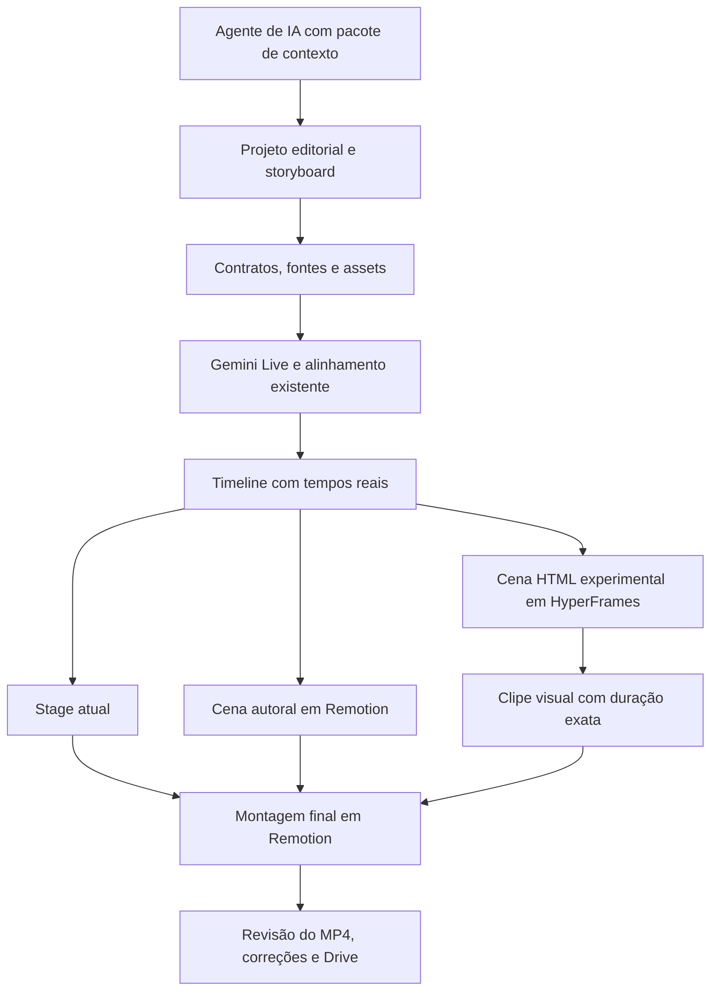

# Plano de evolução visual: HyperFrames e skills portáveis

Data: 7 de outubro de 2026. Base local analisada: `44d28b9c2115266b5b6ab0c63ec3a37baaabc756`.

Status: proposta técnica e editorial. Nenhum motor, skill, dependência, episódio ou workflow de produção foi alterado nesta análise.

## Recomendação

Adotar a organização por skills e o método de direção da referência; ampliar a autoria de cenas; avaliar HyperFrames como ferramenta adicional por cena. A decisão de migrar o render final deve vir depois de uma comparação prática.

O maior ganho provável é permitir que a IA construa a demonstração de cada assunto com ferramentas adequadas e a confira no vídeo. Trocar o renderizador, isoladamente, não garante esse ganho. Remotion já permite animação determinística e composição autoral; nosso caminho diário concentra a autoria em um contrato visual mais restrito.

O sistema deve ser independente da IA que pesquisa, escreve e programa. Isso não significa mudar automaticamente a política de síntese: Gemini 3.8 Live e Roberto/Charon continuam sendo a política vigente de voz. Compatibilidade de autoria e escolha do TTS são decisões separadas.

## 1. Material examinado e alcance

Foi lida a página completa [OPUS 5.5 SHOWREEL](https://app.notion.com/p/OPUS-5-5-SHOWREEL-3ecd07a0c6df8028b89deb53faacfe48) na aba aberta do navegador. Ela reúne a instalação e seis receitas de produção: abertura sobre fala, reel do YouTube, showreel para PiP, anúncio da Insider e duas variações AiVerso. Foram examinados também a skill pública, scripts e referências textuais do autor, documentação oficial do HyperFrames, código local e commits recentes.

Os MP4s de entrega citados no Notion são caminhos locais do autor, não arquivos disponibilizados nessa página. Esta análise não certifica a qualidade desses filmes nem repete como medições próprias os números publicados pelo autor. Também não foi executado benchmark entre os motores.

Referências externas consultadas em `main` são mutáveis. A skill `showreel-interface` estava no commit `abd2fcbeb4924b2b6dbd02a73e815e942b95d314`. A consulta à API oficial do GitHub encontrou a release HyperFrames `v0.8.139`; isso não comprova que todo arquivo de `main` pertence àquela release. A implantação deve fixar um conjunto compatível de CLI, runtime, skills e dependências.

## 2. O que realmente aproveitar da referência

| Princípio do guia | Aplicação no O Dinheiro Explica | Adaptação necessária |
|---|---|---|
| Transcrever antes de animar e ligar eventos à fala | Usar o áudio real para resolver as âncoras de contas, revelações e provas | Já existe alinhamento; melhorar a confirmação dos eventos críticos |
| Ilustrações e interfaces mostram o argumento; texto complementa | Objetos, documentos e gráficos conduzem a explicação | Construir vocabulário do assunto, sem converter toda pauta em interface de aplicativo |
| Analisar referência e transformar o método em skill | Registrar técnicas reutilizáveis de direção, execução e revisão | Separar mecanismo, evidência, scripts e critérios de uso; preservar a identidade do canal |
| Trabalhar com assets e números reais | Capturas, fotografias, séries, unidades e exemplos identificados | Diferenciar evidência documental, contexto e ilustração gerada |
| O próprio objeto conduz a transição | Um objeto ou dado muda de papel e mantém a atenção | Implementar continuidade dentro da cena primeiro; transições entre cenas exigem contrato próprio |
| Renderizar, medir e corrigir | Revisar o que foi efetivamente desenhado e codificado | Métricas adequadas ao gênero e conferência humana da explicação |
| Reservar espaço para PiP | Opção futura para vídeos com apresentador em câmera | Reserva somente quando o formato pedir; não deixar um terço vazio em todo episódio |
| Música dirige o reel promocional | Aplicável a vinhetas, promos e peças sem narração | Nos vídeos explicativos, a fala determina o tempo; música acompanha |

A [skill original](https://github.com/Felpborges/showreel-interface/blob/main/SKILL.md) tem um escopo específico: reels de marca curtos. Sua gramática de continuidade é útil, mas capítulos, dois mundos visuais, estrutura fixa e metas musicais não devem virar a estrutura universal do canal.

## 3. Diagnóstico do sistema atual

### Bases que já funcionam

- O contrato de projeto relaciona roteiro, claims, fontes, assets, cenas e revisão de explicação. Existe validação antes da síntese.
- `EditorialStage` mantém participantes e aplica eventos; `editorial-stage.ts` resolve estados, câmera e transformações por frame.
- Existem contas, comparações, pilhas, medidores, sinais, objetos SVG, gráficos com revelação, fotos e recortes documentais.
- O pipeline prepara mídia, audita geometria com a fonte real, confere novamente com assets e tempos finais e mantém cache de voz compatível.
- `align_narration.py` usa reconhecimento local com timestamps de palavras e confiança. A legenda conserva o texto escrito; o reconhecimento localiza os tempos.
- O render final possui narração contínua, música e SFX; a entrega mede integridade, duração e áudio antes do Drive.

Essas capacidades já aparecem no episódio atual do supermercado: oito cenas, demonstrações de divisão, alteração da quantidade da embalagem, gráfico histórico, fotografia e recorte legal. O diagnóstico não é de ausência de direção visual.

### Limites comprovados e consequências

| Evidência local | Consequência | Evolução proposta |
|---|---|---|
| Não existem `skills/`, `.agents/skills/` ou `.claude/skills/` próprios do repositório | Conhecimento distribuído entre instruções extensas e documentos | Entrada curta e skills por função, carregadas conforme a tarefa |
| `production-chat-request.ts` repete regras editoriais e fixa modo direto | Manutenção duplicada e transporte dependente de um pedido longo | Gerar o pedido a partir de contratos canônicos e modo explícito |
| Stage possui tipos, objetos e operações enumerados; câmera tem limites explícitos | Linguagem segura, mas demonstrações fora do repertório exigem mudar o motor | Caminho autoral adicional com contrato e auditoria próprios |
| Regiões do Stage são reservadas inclusive quando ocultas; sobreposição tem exceções específicas | Montagens, máscaras e continuidade de escala não cabem por mera escolha de JSON | Preservar o Stage e implementar cenas autorais para relações que exijam isso |
| `visualAssetSchema` admite imagens e recortes, não clipes de vídeo | B-roll em movimento ainda não tem um caminho diário completo | Novo contrato de vídeo, procedência, cortes e uso narrativo |
| `align_narration.py:149` usa `base` por padrão; a chamada do Actions não substitui o modelo | Âncoras não reconhecidas permanecem estimadas | Escalada local para cenas críticas, sem nova síntese automática |
| `report-editorial-rhythm.ts` declara que calcula direção com tempos, sem medir o MP4 | Movimento declarado pode diferir do movimento percebido | Complementar com análise do arquivo codificado e dos protagonistas |
| `qa_delivery.py` mede vídeo/áudio e integridade, sem julgamento visual semântico | Entrega técnica válida ainda pode explicar mal | Revisão visual com evidências e conclusão por cena |
| `validate-editorial-layout.ts:46` ignora cenas sem Stage | Uma extensão mal integrada pode escapar da auditoria | Exigir adapter de auditoria para todo novo renderer e registrar cobertura |
| `docs/architecture.md` ainda descreve MVP sem render e Kokoro futuro | Uma IA pode planejar pelo documento antigo | Atualizar arquitetura antes de transformá-la em contexto canônico |

A liberdade desejada não pede remover proteções do Stage. Pede um caminho adicional que consiga demonstrar segurança e legibilidade nas composições que o Stage não representa.

## 4. Skills que devem pertencer ao projeto

Guardar uma fonte canônica em `skills/`. Instalações reconhecidas por cada agente são adaptadores gerados ou ligações para essa fonte, sem versões editoriais independentes em cada pasta.

| Skill proposta | Responsabilidade | Entrega verificável |
|---|---|---|
| `ode-video` | Entrada, identificação do estado, modo de produção e encaminhamento | Brief, capacidades disponíveis, etapas pendentes e localização dos artefatos |
| `ode-editorial` | Pesquisa, conflito, explicação, condições e fechamento da promessa | Claims/fontes, narrativa e contrato de explicação coerentes |
| `ode-direction` | Traduzir cada afirmação em demonstração e escolher a composição | Storyboard com protagonista, estados, dados, transformação, âncora e saída |
| `ode-motion` | Executar câmera, máscaras, continuidade e operações no motor escolhido | Composição determinística e mapa de eventos implementados |
| `ode-evidence` | Obter e preparar imagens, documentos, gráficos e clipes | Manifesto de procedência, créditos, hashes e função narrativa |
| `ode-voice-sync` | Aplicar política vocal, cache, alinhamento e sincronização de eventos | Tempos com origem/confiança e diagnóstico dos eventos críticos |
| `ode-review-delivery` | Revisar resultado, corrigir e retomar até a entrega | Quadros do MP4, parecer por cena, relatórios e confirmação dos arquivos no Drive |
| `ode-packaging` | Fazer título, capa e descrição entregarem a mesma promessa | Embalagem revisada conforme o contrato atual |

Cada skill deve conter: gatilho e limites; pré-requisitos; entradas/saídas com schema; procedimento curto; referências carregadas por necessidade; exemplo bom e exemplo inadequado; comandos reais; diagnóstico e retomada. Uma skill deve ensinar decisões e fornecer meios de verificar sua execução.

O material do canal pode alimentar Markdown e JSON próprios; o arquivo `SKILL.md` é uma forma de distribuição. Um agente sem descoberta automática de skills recebe o mesmo pacote de contexto explicitamente.

### Portabilidade concreta

1. Não usar `/goal`, ferramentas privativas, nome de modelo de autoria ou diretório de um fornecedor como dependência do núcleo.
2. Resolver recursos a partir da raiz do projeto, com caminhos relativos e executáveis configuráveis para Windows e Linux.
3. Exportar schemas, exemplos válidos, capacidades do motor e diagnóstico em JSON.
4. Criar uma interface de comandos que encapsule as etapas existentes. Nomes sugeridos: `context`, `capabilities`, `preflight`, `render`, `review` e `resume`. Esses comandos ainda não existem.
5. Registrar o estado de execução em arquivo versionado de contrato: hashes, outputs, etapa concluída, falha, modo, aprovações existentes e revisão pendente. Não depender da memória de um chat para retomar.
6. Gerar wrappers opcionais para os agentes utilizados; testar que todos consomem os mesmos contratos.

“Qualquer IA” significa portabilidade para agentes capazes de ler arquivos, produzir dados/código e operar as ferramentas necessárias. Não significa qualidade equivalente entre modelos. Um modelo sem ferramentas pode preparar o pacote, que um executor validará e produzirá.

O [aceite original](https://github.com/Felpborges/showreel-interface/blob/main/scripts/aceite.py) depende de um script em `~/.claude/skills/motion-por-referencia/`; o [capturador](https://github.com/Felpborges/showreel-interface/blob/main/scripts/shoot.sh) fixa o Chrome de macOS. É preciso adaptar essas dependências para a nossa infraestrutura. Não basta mudar o texto de instalação.

## 5. Arquitetura visual recomendada

### Caminho A: cenas autorais no Remotion

Adicionar seleção explícita de renderer por cena e um registro local de composições. O JSON seleciona uma implementação e fornece parâmetros validados; não recebe código executável arbitrário dentro de strings.

Uma cena autoral recebe dados, assets preparados, eventos resolvidos, duração e identidade. Pode implementar camadas, máscaras, mudança de escala, percurso e transformação preservando os participantes. Deve publicar também estados de prova, regiões de texto/legenda e associação com as unidades explicativas.

Manter `visual.stage` como o caminho compatível dos episódios existentes. A revisão usa o resolver atual para Stage e adapters específicos para cenas autorais. Renderer sem auditoria implementada deve falhar com diagnóstico, não retornar aprovação vazia.

### Caminho B: HyperFrames por cena

No piloto, compor a cena em HTML/CSS/SVG com timeline controlável pelo tempo, assets e fontes locais e versão fixada. Renderizar somente a imagem em movimento; usar os mesmos frames e duração da timeline resolvida. Importar o clipe na montagem atual, que conserva narração, legenda e mixagem.

Isso evita duas sínteses, duas trilhas ou duas autoridades para a duração. Introduz, porém, preparação de clipes e uma possível etapa extra de compressão. O piloto deve medir qualidade, tempo, tamanho, cor, fps, timestamps e custo de correção desse percurso. Se o clipe precisar de transparência, o formato terá que ser avaliado; MP4 H.264 comum não resolve alpha.

O contrato do clipe precisa declarar regiões de legenda ao longo do tempo ou desativá-la conscientemente na cena. A atual descoberta de espaço livre do Stage não pode ser presumida válida sobre um vídeo opaco.

Preflight estrutural e de dados acontece antes do TTS; tempos finais e cenas/clipes são resolvidos depois do alinhamento. O ambiente de render deve executar o código visual com acesso somente aos assets necessários, sem credenciais da produção dentro da página.

O [HyperFrames já documenta suporte a diferentes agentes](https://github.com/heygen-com/hyperframes). Seu benefício técnico é autoria HTML e runtimes controláveis pelo tempo; [Remotion já oferece composição por frame](https://hyperframes.heygen.com/guides/hyperframes-vs-remotion). São modelos diferentes de autoria, não graus automáticos de qualidade.

Uma migração completa deve ser opcional e posterior: exigiria transferir layout, legenda, operações, áudio contínuo, preparação, cache e entrega. A [skill de migração oficial](https://github.com/heygen-com/hyperframes/blob/main/skills/remotion-to-hyperframes/SKILL.md) possui limites e não garante uma tradução completa deste projeto.

## 6. Melhorias visuais prioritárias

### Demonstração por estados

Acrescentar ao storyboard estados iniciais, intermediários, prova principal e estado final. Cada transformação explica uma relação: qual participante muda, qual dado muda, o que permanece e em que trecho da fala isso deve acontecer.

Exemplo interno usando a pauta já existente: a embalagem é o mesmo participante; sua quantidade diminui; o preço permanece estável; o preço por unidade aparece como consequência da divisão. É um exemplo de direção para comparação técnica, não proposta de repetir ou republicar a pauta.

Selecionar técnicas conforme a relação: transformação do mesmo objeto, máscara documental, cálculo em etapas, revelação de séries e continuidade entre escala geral e detalhe. Um catálogo deve guardar primitivas e seus limites, sem fixar uma sequência de cenas.

### Identidade em `frame.md`

Consolidar paleta #FFBD19/grafite/branco, fonte, pesos, tratamento de mídia, hierarquia e regras de leitura no vídeo. Tamanhos devem depender da resolução e do papel do conteúdo. Composição e metáfora permanecem abertas à pauta. O princípio está na [referência criativa do HyperFrames](https://github.com/heygen-com/hyperframes/blob/main/skills/hyperframes-creative/SKILL.md).

### Sincronização de eventos críticos

Continuar usando o roteiro como autoridade textual e o áudio como autoridade temporal. Acrescentar exigência de confirmação por evento: uma revelação factual, resultado de conta ou destaque documental crítico precisa de âncora confirmada ou correção manual registrada.

Melhorar somente cenas cujo alinhamento esteja insuficiente: modelo local maior ou um alinhador apropriado, medido em PT-BR e nas pronúncias do canal. Avaliar `large-v3` como candidato, sem assumir que troca de modelo entrega precisão de frame. Usar uma amostra anotada para medir erro temporal e tempo de processamento. Falha de ASR não deve pedir nova voz automaticamente.

### Som e música

O canal já tem SFX sintetizados e cama musical; a evolução é direção e mixagem por evento. Declarar o instante do pico do efeito, não apenas seu início; abaixar a música quando a fala exigir; dar repouso sonoro para provas e contas.

Adotar relógios explícitos: narração para episódio explicativo; música para vinheta/promo; gravação original para edição de entrevista. Não ajustar a velocidade da voz nem esconder palavras para caber numa grade musical. Processamento da mix final deve respeitar a política atual de preservação do WAV bruto.

### B-roll e mídia gerada

Adicionar clipes com origem, licença/crédito, duração, fonte temporal, pontos de entrada/saída e função narrativa. Capturas reais e vídeos contextuais podem diversificar a linguagem. Imagem gerada pode ilustrar uma metáfora identificada, mas não representar notícia, documento ou ação real como evidência.

Criar adapters opcionais de geração por capacidade. Higgsfield é parte da receita original; não precisa ser uma dependência do canal. A arquitetura recebe um asset com proveniência independentemente de onde ele foi obtido.

## 7. Revisão baseada no MP4 real

Complementar os relatórios existentes com um pacote de revisão contendo:

- Quadros extraídos do arquivo final: início, estados de prova, intermediários relevantes, vizinhança das emendas e final de cada cena.
- Linha do tempo visual com fala, eventos, presença dos protagonistas e SFX.
- Métricas de diferença entre frames e, quando útil, movimento por região; registrar resolução de análise, fps, método e limitações.
- Leitura dos números/unidades, contraste e enquadramento; OCR pode auxiliar e deve informar incerteza.
- Verificação de sync nas âncoras críticas e do pico sonoro no evento correspondente.
- Parecer editorial por cena: a imagem demonstrou a afirmação? Os limites ficaram claros? Houve tempo de leitura? A conclusão entregou a pergunta?

Separar movimento de câmera, protagonista, informação, legenda e fundo. Um glow ou legenda mudando não deve esconder um protagonista que ficou parado durante a explicação de uma transformação.

Comparar os dados aos intervalos sem transformação que já calculamos. Métricas visuais não demonstram, sozinhas, causalidade nem compreensão. Conferência do MP4 com áudio permanece necessária; uma revisão feita pela IA deve citar tempos e quadros, e registrar o que não conseguiu observar.

O [medidor de referência](https://github.com/Felpborges/motion-por-referencia/blob/main/scripts/pericia-movimento.py) calcula energia por diferença entre quadros. É um ponto de partida para diagnóstico. Mudança de textura, compressão e câmera afetam essa medida, portanto um número maior não significa explicação melhor. As metas do reel original são próprias daquele gênero, não gates universais para o canal.

Não prometer ganho de retenção ou CTR por contagem de cortes. Medir esses resultados depois, nos dados reais do canal e com contexto de pauta, público, título e thumbnail.

## 8. Plano de implementação e critérios de saída

| Etapa | Entregas | Esforço relativo | Critério de conclusão |
|---|---|---|---|
| 1 — Contexto e skills | Atualizar arquitetura; entrada `ode-video`; direção e revisão; manifestos de capacidades; pedido gerado | Médio | Agentes diferentes conseguem localizar contratos, preparar o mesmo formato e retomar estado sem depender do chat anterior |
| 2 — Autoria e sincronização | Registro de cenas Remotion; contrato autoral; `frame.md`; eventos críticos confirmados; auditoria com cobertura explícita | Grande | Uma demonstração que o Stage não representa roda com os mesmos dados/voz, sem escapar dos gates |
| 3 — Piloto HyperFrames | Versão fixada; workspace isolado; adapter de clipes; 3 demonstrações comparáveis | Médio a grande | Comparação documentada de clareza, determinismo, correção, tempo e qualidade de encode |
| 4 — Revisão e áudio | Extração de quadros do MP4; diagnóstico regional; cues pelo pico; parecer de cenas; cache visual | Médio | Cada falha identificada pode ser localizada, corrigida e retomada preservando áudio válido |
| 5 — Mídia e formatos | B-roll, geração opcional, recomposição 9:16 e painel de revisão | Grande | Novo formato preserva relações e legibilidade; mídia tem procedência; entrega usa o fluxo existente |

As etapas 2 e 3 podem trocar de ordem se o piloto precisar responder primeiro à escolha de motor. A etapa 1 e os contratos de revisão devem preceder a entrada de um novo caminho em produção. Esses tamanhos são estimativas de escopo, não prazos nem orçamento fechado.

### Piloto recomendado

Comparar três mecanismos internos, com o mesmo roteiro, dados e áudio existente quando disponível:

1. Transformação de objeto com continuidade de identidade.
2. Conta/comparação com números e unidades legíveis.
3. Documento real que passa de contexto geral para destaque do trecho.

Usar Stage como base; Remotion autoral e HyperFrames como alternativas. Avaliar no Windows local e no Linux do Actions. Registrar versão, inputs, hardware, frames, tempo de render e revisão, artefatos e diferenças visuais. Não atribuir vantagem de performance a uma ferramenta sem essa medição.

Critérios objetivos: duração e fps corretos; nenhuma informação factual antecipada; texto integralmente legível nos estados de prova; nenhuma falha de cobertura da auditoria; mesmo estado visual ao consultar instantes em ordem diferente; identidade de participantes preservada; áudio compatível reaproveitado; retomada localizada após uma falha. A clareza e a adequação da linguagem exigem avaliação do filme.

Resultados possíveis: manter Remotion com as novas skills; adotar HyperFrames somente em cenas específicas; ou planejar migração gradual se o ganho compensar a manutenção e a nova cadeia de encode. Nenhum resultado precisa ser pré-escolhido para justificar o piloto.

### Cache e retomada

Preservar os fingerprints vocais atuais. Adicionar cache de clipe visual por código/composição, parâmetros, assets e fonte, dimensões/fps, eventos resolvidos, duração e versão do motor. Alteração do alinhamento ou de um asset invalida somente as cenas visuais dependentes. Alteração apenas visual não invalida TTS.

### Compatibilidade com produção direta

O trabalho de infraestrutura deve ser desenvolvido e verificado em solicitações próprias. Em futuras produções diretas sem testes, não disparar suítes, benchmarks, prévias ou renders de demonstração. Conservar preparação obrigatória, contratos, integridade, alinhamento e revisão da produção real conforme AGENTS.md; registrar as verificações não realizadas. A portabilidade não deve reintroduzir entrevistas ou aprovações já resolvidas pela conversa.

## 9. Pontos de alteração no repositório

| Arquivo/área atual | Mudança prevista |
|---|---|
| `AGENTS.md`, `prompts/daily-editorial.md`, `docs/architecture.md` | Entrada clara para contratos canônicos e fluxo realmente implementado; preservar preferências editoriais |
| `src/lib/production-chat-request.ts` | Gerar contexto e modo sem copiar todo o manual |
| `skills/` e scripts de distribuição novos | Núcleo portável, referências e adapters de descoberta por agente |
| `src/lib/video-project-schema.ts` | Renderer e mídia adicionais; requisitos de evidência e revisão |
| `src/lib/editorial-stage.ts` | Manter compatibilidade; evoluções do Stage somente quando adequadas ao contrato |
| `video/src/DailyEditorial.tsx` e registro novo | Selecionar composição por cena; preservar áudio/legenda; integrar clipes visuais |
| `scripts/validate-editorial-layout.ts` | Auditoria por renderer, sem cena nova silenciosamente ignorada |
| `worker/align_narration.py`, `worker/build_render_input.py` | Confirmação de eventos críticos e preparação de tempos para novos caminhos |
| `worker/prepare_visual_assets.py` e adapter de clipes novo | Mídia em movimento, metadados, preparação e hashes |
| `scripts/report-editorial-rhythm.ts`, `worker/qa_delivery.py`, revisor visual novo | Distinguir contrato, execução visual e julgamento editorial |
| `.github/workflows/render-daily.yml` | Preparar caminhos novos, preservar cache/entrega e respeitar o modo solicitado |

As primeiras entregas devem melhorar o contexto que a IA recebe e a forma como o resultado é julgado. A entrada do HyperFrames terá valor quando facilitar demonstrações concretas com esse mesmo contrato editorial.
